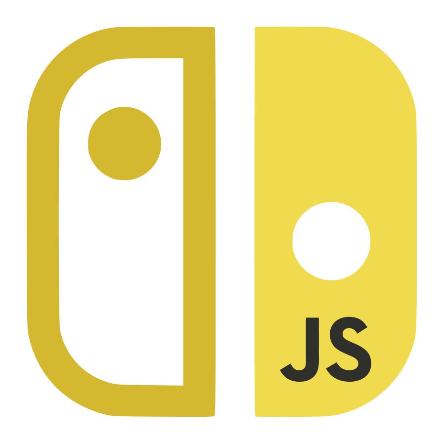

# nxjs-phaser-poc

This is a Phaser 3 template that has been modified to be able build and run on the Nintendo Switch using the [nx.js](https://nxjs.n8.io/) runtime

**nx.js** is a framework that enables the development of Nintendo Switch homebrew applications using JavaScript. Powered by the QuickJS engine, nx.js provides a streamlined environment for writing homebrew applications for the Nintendo Switch console.

### Versions

This template has been updated for:

- [Phaser 3.70.0](https://github.com/phaserjs/phaser)
- [Vite 5.2.11](https://github.com/vitejs/vite)
- [TypeScript 5.4.5](https://github.com/microsoft/TypeScript)

### Features

At the moment, this template is only able to draw primitive scenes. The following work still needs to be done to have a functional game:

- Image loading
- Text rendering
- Input handling
- Audio playback

## Resources

### nx.js

**Visit:** The [nx.js website](https://nxjs.n8.io/) 
**Learn:** [API Docs](https://newdocs.phaser.io) 
**Code:** [Examples](https://github.com/TooTallNate/nx.js/blob/main/apps) 
**Discord:** Join us on [Discord](https://discord.gg/MMmn73nsGz)

### Phaser
**Visit:** The [Phaser website](https://phaser.io) and follow on [Phaser Twitter](https://twitter.com/phaser_) 
**Play:** Some of the amazing games [#madewithphaser](https://twitter.com/search?q=%23madewithphaser&src=typed_query&f=live) 
**Learn:** [API Docs](https://newdocs.phaser.io), [Support Forum](https://phaser.discourse.group/) and [StackOverflow](https://stackoverflow.com/questions/tagged/phaser-framework) 
**Discord:** Join us on [Discord](https://discord.gg/phaser) 
**Code:** 2000+ [Examples](https://labs.phaser.io) 
**Read:** The [Phaser World](https://phaser.io/community/newsletter) Newsletter 

Original template created by [Phaser Studio](mailto:support@phaser.io). Powered by coffee, anime, pixels and love.

## License

nx.js is released under the MIT License. Please see the [LICENSE](https://github.com/TooTallNate/nx.js/blob/main/LICENSE) file for more details.

The Phaser logo and characters are &copy; 2011 - 2024 Phaser Studio Inc.